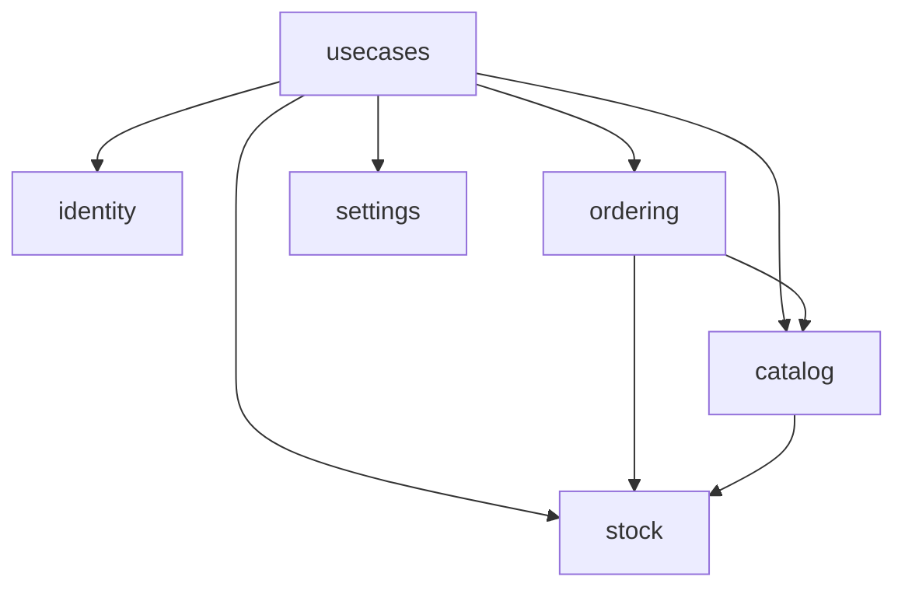
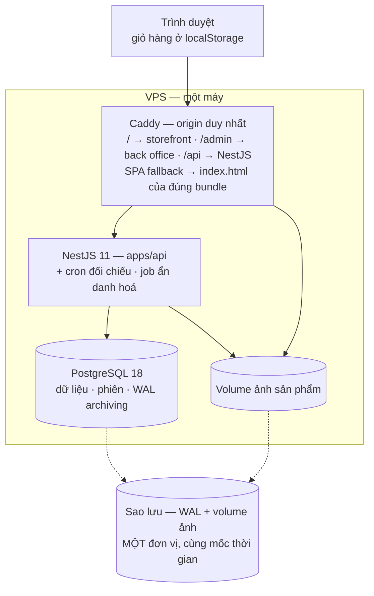
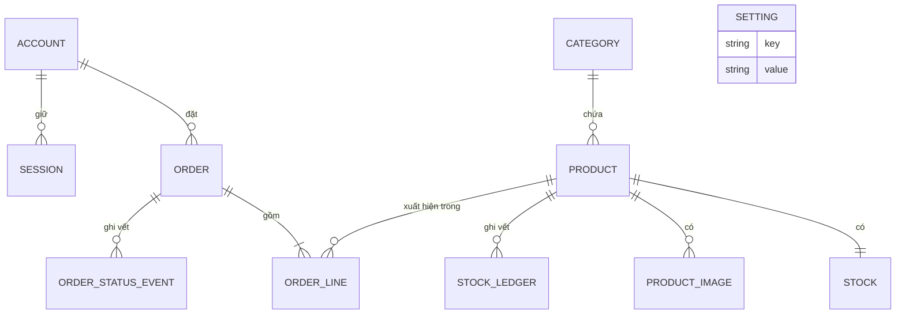

# Architecture Spine — Shop Online

> **Đây là bản baseline.** Bản thô của phiên `bmad-architecture` nằm ở
> `planning-artifacts/architecture/architecture-sdd-framework-demo-2026-09-19/`,
> cùng `.memlog.md` (lý do đằng sau từng quyết định) và `reviews/` (6 báo cáo
> đối chiếu và review). Bản thô là nháp; file này là baseline (CLAUDE.md §6).

## Design Paradigm

**Modular monolith.** Mỗi bounded context là một Nest module sở hữu bảng của chính nó; bên trong giữ lối mòn `controller → service → repository`.

Năm miền: `identity` · `catalog` · `stock` · `ordering` · `settings`

Trên chúng là một tầng **`usecases`** mỏng: nơi duy nhất mà một thao tác chạm nhiều miền được dàn dựng. Nó tồn tại vì `FR-25`, `FR-24` và màn hình sổ cái `FR-27` đều cần dữ liệu từ hai miền mà đồ thị phụ thuộc không cho nối trực tiếp — không có tầng này, ba yêu cầu đó không hiện thực được mà không phá luật.

Không có module `cart`: giỏ hàng sống hoàn toàn ở trình duyệt (AD-17). Không có module `payment`: phương thức thanh toán và xác nhận thanh toán là **thuộc tính của `Order`**, và `FR-24` là một luật chuyển trạng thái — cả hai thuộc `ordering`.

Hướng phụ thuộc là **luật**. Mũi tên là chiều được phép gọi; không có mũi tên nghĩa là cấm.



Không module nào gọi ngược chiều mũi tên, và **không module nào biết `usecases` tồn tại**. `stock` không biết `ordering` tồn tại. Đồ thị không có chu trình; thêm một mũi tên tạo chu trình là một thay đổi kiến trúc, không phải một task.

## Invariants & Rules

### AD-1 — Mọi thay đổi tồn kho là một delta có điều kiện, áp ở tầng dữ liệu

- **Binds:** FR-14, FR-15, FR-18, **FR-27**, SM-1, bất biến §8 #1 và #2
- **Prevents:** (a) một đường ghi kiểm tra tồn kho bằng `if` trong code rồi ghi — đúng dưới test đơn luồng, sai dưới tải đồng thời; (b) **điều chỉnh tồn kho tay (FR-27) là một phép *gán tuyệt đối*, nên nó hợp lệ khi đọc-rồi-ghi — và nó ghi đè phần trừ kho của một đơn đang đặt song song. `CHECK` không bắn, cron AD-4 chỉ thấy sau khi hàng ma đã bán mất.**
- **Rule:** cột `stock.quantity` mang `CHECK (quantity >= 0)`. **Phép gán tuyệt đối không phải một primitive.** Mọi thay đổi — trừ khi đặt đơn, hoàn khi huỷ, và điều chỉnh tay — đều biểu diễn thành một delta và áp bằng một câu duy nhất có điều kiện trên giá trị đang có: trừ kho dùng `... SET quantity = quantity - :n WHERE product_id = :id AND quantity >= :n`; điều chỉnh tay dùng `... SET quantity = quantity + :delta WHERE product_id = :id AND quantity = :seen`, trong đó `:seen` là con số chủ shop đang nhìn. **Số dòng bị ảnh hưởng = 0 là kết quả hợp lệ và phải được xử lý** — thiếu hàng khi trừ, hoặc số đã đổi dưới tay khi điều chỉnh. Không đường nào được `SELECT` rồi `UPDATE` theo giá trị vừa đọc.

### AD-2 — `stock` là chủ sở hữu duy nhất của đường ghi vào tồn kho

- **Binds:** `stock`, `ordering`, `catalog`, `usecases`, FR-15, FR-18, FR-27
- **Prevents:** `ordering` trừ kho khi đặt đơn còn `catalog` cộng kho khi chủ shop điều chỉnh — hai chủ sở hữu của một con số, và AD-1 chỉ đúng ở đường nào nhớ áp dụng nó.
- **Rule:** bảng `stock` và `stock_ledger` thuộc module `stock`. Không module nào khác `SELECT`, `UPDATE` hay `INSERT` vào hai bảng đó. Mọi thay đổi đi qua service công khai của `stock`, và **mỗi thay đổi ghi một dòng `stock_ledger` trong cùng đơn vị công việc** (AD-23) — không có API nào đổi kho mà không ghi vết. `stock` nhận `order_id` như một **giá trị**, không tra cứu nó, không phụ thuộc vào nó.

### AD-3 — Đặt đơn: một đơn vị công việc, thứ tự khoá cố định, thất bại phải giải thích được

- **Binds:** FR-14, FR-15, UJ-6, NFR p95 đặt đơn ≤ 1,0 s, SM-C1
- **Prevents:** (a) deadlock giữa hai đơn cùng chứa sản phẩm A và B theo thứ tự ngược nhau; (b) đơn được tạo trong khi một dòng thiếu hàng; (c) màn *"Đơn chưa đặt được"* chỉ nêu được **một** dòng thiếu trong khi UX yêu cầu nêu **đủ** — rollback ở dòng đầu tiên thất bại khiến hệ thống không bao giờ biết hết.
- **Rule:** tạo đơn, trừ kho mọi dòng, và ghi sổ cái nằm trong **một đơn vị công việc do `ordering` mở** (AD-23), các dòng xử lý theo **`product_id` tăng dần**, luôn luôn. Bất kỳ dòng nào trả về 0 dòng bị ảnh hưởng thì rollback toàn bộ và **không có đơn nào tồn tại**. Sau khi rollback, `ordering` thực hiện **một lần đọc riêng, ngoài đơn vị công việc**, trả về *mọi* dòng không đủ hàng kèm số lượng hiện có; kết quả này là **tham khảo, không phải cam kết**, và hợp đồng API phải gọi nó đúng như vậy.
- **Trần, không phải mục tiêu (SM-C1):** ngưỡng p95 ≤ 1,0 s là **giới hạn trên**. Không tối ưu nào được mua độ trễ bằng cách nới lỏng tính nguyên tử ở AD-1. Nếu phải chọn, chọn chậm hơn.

### AD-4 — Tồn kho là cột được duy trì; sổ cái là bản kiểm toán; lệch là một sự cố

- **Binds:** FR-27, SM-1, SM-3, NFR p95 đọc ≤ 400 ms
- **Prevents:** hai cách trả lời câu hỏi "còn bao nhiêu hàng" cùng tồn tại và trả lời khác nhau.
- **Rule:** `stock.quantity` là **nguồn sự thật cho mọi đường đọc**. `stock_ledger` là append-only, không bao giờ `UPDATE` hay `DELETE`, và mỗi dòng gồm: `product_id`, `delta`, `quantity_after`, `reason ∈ {order_placed, order_cancelled, manual_adjustment}`, `order_id` (rỗng với `manual_adjustment`), `actor_account_id`, `created_at`. Một cron trong process đối chiếu `quantity` với tổng `delta`; **chênh lệch là một sự cố theo định nghĩa ở mục *Quan sát và sự cố***, không phải một cảnh báo — nó có nghĩa là một đường ghi đã vòng qua AD-2.

### AD-5 — Ranh giới module là ranh giới dữ liệu

- **Binds:** cả năm module + `usecases`
- **Prevents:** hai module cùng đọc-ghi một bảng, khiến không ai biết luật nào áp cho bảng đó; và task brief không vạch được `forbidden scope` vì mọi thứ chạm tới mọi thứ.
- **Rule:** một bảng thuộc đúng một module. Truy cập chéo **chỉ** qua service công khai (`<domain>.public.ts`). Không `JOIN` qua biên module trong repository, không import repository của module khác. Dữ liệu nhiều miền được **ghép ở tầng `usecases`** bằng nhiều lời gọi service. Khoá ngoại vượt biên là chuyện của tầng dữ liệu và được quyết định riêng ở AD-24 — **khoá ngoại không bao giờ là giấy phép `JOIN`**.

### AD-6 — Email là định danh, không bao giờ là địa chỉ gửi

- **Binds:** `identity`, PRD §6, FR-9, FR-10
- **Prevents:** trường email nằm sẵn trong schema cám dỗ người xây sau nối SMTP vào để "gửi mail xác nhận đơn cho tiện" — đúng khoảnh khắc đó `PRD §6` gãy.
- **Rule:** không có thư viện gửi mail, không client SMTP, không cổng SMS trong `package.json` của bất kỳ app nào. `account.email` chỉ dùng để tra cứu khi đăng nhập và để hiển thị. Thêm một kênh gửi là thay đổi phạm vi, phải leo lên `baseline/*`.
  > **Sai lệch có ý thức so với `PRD §9.2`:** §9.2 đòi mỗi trường PII phải chỉ ra được nó phục vụ giao hàng thế nào. Email **không** phục vụ giao hàng. Người quyết định đã chọn email sau khi được nêu rõ cái giá này. Ghi ở đây để không ai đọc spine mà tưởng §9.2 được thoả.

### AD-7 — Chủ shop đặt lại được mật khẩu nhưng không mạo danh được khách

- **Binds:** `identity`, PRD §5, bất biến §8 #3
- **Prevents:** quyền đặt lại mật khẩu (Q10) biến chủ shop thành người đăng nhập được vào mọi tài khoản khách — vòng qua bất biến "không khách hàng nào đọc được dữ liệu của khách khác" bằng chính cửa quản trị.
- **Rule:** đặt lại sinh một mật khẩu tạm ngẫu nhiên, hiện đúng một lần, **bắt buộc đổi ở lần đăng nhập kế tiếp**, và không dùng được cho việc gì khác trước đó. Chủ shop không bao giờ đọc được mật khẩu hiện tại. Mỗi lần đặt lại ghi dấu vết và **huỷ mọi phiên đang mở** của tài khoản đó — điều này đòi phiên phải thu hồi được, xem AD-8.

### AD-8 — Một origin, phiên lưu ở server, và hai bề mặt không dùng chung cookie

- **Binds:** `identity`, FR-10, FR-32, AD-7, bất biến §8 #3
- **Prevents:** (a) tách FE/BE đẩy dự án tới JWT trong `localStorage`, và một lỗ XSS bất kỳ trở thành đọc trộm dữ liệu khách khác; (b) JWT tự chứa **không thu hồi được**, làm lời hứa "huỷ mọi phiên" của AD-7 thành không hiện thực được; (c) một cookie dùng chung cho cả hai bề mặt khiến phiên chủ shop đi kèm mọi request phát từ Trang bán hàng.
- **Rule:** cả ba phục vụ sau **một origin** qua reverse proxy. Phiên là **bản ghi trong PostgreSQL**, không phải token tự chứa — huỷ phiên là xoá dòng. Cookie `httpOnly; Secure; SameSite=Lax`, **không token nào vào `localStorage` hay `sessionStorage`**. Trang bán hàng và Trang quản trị dùng **hai tên cookie khác nhau**; endpoint quản trị chỉ chấp nhận cookie của Trang quản trị, và một phiên `customer` không bao giờ mở được endpoint quản trị. Không cấu hình CORS cho origin khác.

### AD-9 — Trang quản trị là một bundle riêng, không bao giờ tới trình duyệt khách

- **Binds:** app `backoffice`, app `storefront`, quyết định IA của UX
- **Prevents:** UX chốt *"khách không bao giờ thấy Trang quản trị tồn tại"*, nhưng một SPA duy nhất gửi code back office cho mọi khách vãng lai — route, tên trường, luồng nghiệp vụ đọc được trong DevTools.
- **Rule:** hai Vite build tách biệt, hai entry point, hai thư mục output. **Lazy route chunk không thoả** — chunk vẫn nằm trong manifest của bundle khách. Không component nào import chéo giữa hai app; thứ dùng chung đi qua `packages/ui`.

### AD-10 — Hợp đồng HTTP có đúng một nguồn sự thật, và nó tách theo bề mặt

- **Binds:** `apps/api`, `apps/storefront`, `apps/backoffice`, `packages/shared`
- **Prevents:** BE đổi hình dạng `Order`, FE vẫn khai lại theo trí nhớ của tài liệu API, hai bên trôi khỏi nhau cho tới khi một trường im lặng thành `undefined` ở production.
- **Rule:** mọi hình dạng đi qua biên HTTP định nghĩa **một lần** trong `packages/shared` (schema + type suy ra từ schema), validate ở cả hai phía bằng chính schema đó. FE không khai lại interface cho response; BE không khai lại cho request. `packages/shared` tách hai không gian tên **`storefront`** và **`backoffice`**; một type chỉ nằm ở không gian tên chung khi cả hai bề mặt cần nó ở **cùng** hình dạng.

### AD-11 — Chuẩn hoá tìm kiếm lúc ghi, không lúc đọc

- **Binds:** `catalog`, FR-2, FR-3, NFR p95 đọc ≤ 400 ms ở 20.000 sản phẩm
- **Prevents:** cài "tìm bỏ dấu vẫn khớp" bằng cách chuẩn hoá trong câu truy vấn — cách đó **phá index** và chỉ lộ ra khi dữ liệu đủ lớn, tức sau khi đã lên production.
- **Rule:** `product.name_normalized` (bỏ dấu, chữ thường) ghi **trong cùng thao tác** với `product.name` và mang index. Tìm kiếm chỉ đọc cột đã chuẩn hoá. Không hàm chuẩn hoá nào ở vế trái của `WHERE`.

### AD-12 — Đơn hàng sao chép, không tham chiếu

- **Binds:** `ordering`, FR-12, FR-15, FR-20, FR-21, bất biến §8 #4
- **Prevents:** đổi giá một sản phẩm hoặc `Ngừng bán` nó làm thay đổi hoặc làm hỏng những đơn đã tạo trước.
- **Rule:** `order_line` giữ **giá tại thời điểm đặt đơn** như giá trị của chính nó. Tên người nhận, số điện thoại, địa chỉ được **copy vào đơn**, không trỏ tới hồ sơ. Sau khi tạo, các trường này chỉ đổi qua đúng ba đường: nhập phí giao hàng (FR-20), xác nhận thanh toán (FR-24), và ẩn danh hoá (AD-26). Nhập phí ghi `shipping_fee_updated_at` — UX hiển thị mốc này cho khách (FR-21) và nó **không tồn tại ở đâu khác**, vì nhập phí không đổi trạng thái nên không sinh `order_status_event`.

### AD-13 — Cô lập dữ liệu khách được ép ở tầng repository, và rò rỉ trả 404

- **Binds:** `ordering`, `identity`, FR-16, FR-17, FR-31, FR-32, AD-18, bất biến §8 #3
- **Prevents:** lọc theo chủ sở hữu ở tầng controller — một controller mới quên lọc là đủ để thủng, và không có gì ở tầng dưới chặn lại.
- **Rule:** repository của `ordering` **không phơi ra phương thức nào đọc đơn mà không nhận `customer_id`** — kể cả tra cứu theo khoá idempotency (AD-18). Truy cập của chủ shop đi qua một phương thức riêng tên rõ ràng. Truy cập vào đơn của khách khác trả **404**, không phải 403. **Ngoại lệ duy nhất:** job ẩn danh hoá (AD-26) chạy ngoài ngữ cảnh request và có đường đọc riêng, tên rõ ràng, không bao giờ gắn vào một controller.

### AD-14 — Chuyển trạng thái đơn đi qua đúng một cửa, và cửa đó khoá dòng

- **Binds:** `ordering`, FR-16, FR-17, FR-18, FR-19, FR-22, FR-24, SM-3, SM-4
- **Prevents:** (a) luật vòng đời rải ra nhiều controller — `delivered` đảo ngược được ở một chỗ, huỷ đơn đã nhận tiền lọt ở chỗ khác; (b) **hai tab của chủ shop cùng huỷ một đơn `placed`: cả hai đều qua bảng chuyển hợp lệ, cả hai đều gọi hoàn kho, và tồn kho được cộng hai lần** — đúng điều FR-18 cấm.
- **Rule:** một hàm duy nhất trong `ordering` thực hiện mọi chuyển trạng thái, đối chiếu một bảng chuyển hợp lệ khai báo tường minh. Nó **khoá dòng đơn** (`SELECT ... FOR UPDATE`) trước khi đọc trạng thái, và ghi bằng câu có điều kiện trên trạng thái kỳ vọng — **hai lần chuyển đồng thời thì đúng một lần thắng**. Nó là nơi duy nhất gọi `stock` để hoàn kho, và **chỉ hoàn khi chuyển từ `placed` hoặc `confirmed`** sang `cancelled`. **Mọi trường mà bảng chuyển hợp lệ đọc tới — `payment_confirmed_at`, `shipping_fee` — chỉ được ghi dưới cùng khoá dòng đó**, nếu không một đơn có thể vừa `cancelled` vừa đã nhận tiền, kho đã hoàn còn tiền thì giữ, trong một sản phẩm cố ý không có quy trình hoàn tiền. Mỗi lần chuyển ghi một dòng `order_status_event`. Không controller nào `UPDATE` trực tiếp cột trạng thái.

### AD-15 — Ảnh sản phẩm nằm trên đĩa, và sao lưu phải ôm cả đĩa

- **Binds:** `catalog`, FR-28, NFR RPO 1 h, PRD §6
- **Prevents:** `PRD §6` cấm S3/CDN nên ảnh buộc phải nằm cục bộ — và khi đó rất dễ sao lưu database mỗi giờ mà quên volume ảnh, khiến **RPO của ảnh là vô hạn** trong khi báo cáo vẫn ghi "RPO 1 giờ".
- **Rule:** ảnh lưu trên một volume có tên, phục vụ qua reverse proxy. Sao lưu là **một đơn vị duy nhất gồm WAL archive + volume ảnh**; không sao lưu riêng lẻ. Khôi phục phải đưa cả hai về cùng một mốc thời gian.

### AD-16 — Không phụ thuộc hạ tầng ngoài tiến trình

- **Binds:** cả hệ thống, PRD §6
- **Prevents:** một task lôi Redis vào làm cache session, hoặc một hàng đợi vào làm job nền, và ràng buộc định danh của sản phẩm mất đi từng mảnh mà không ai ra quyết định.
- **Rule:** phụ thuộc runtime chỉ gồm **PostgreSQL và hệ tệp cục bộ**. Cache, lập lịch, job nền và kho phiên chạy trong tiến trình NestJS hoặc trong PostgreSQL. Thêm bất kỳ dịch vụ mạng nào là thay đổi phạm vi trên `baseline/*`. Quyền dùng cache **không áp cho tồn kho** — xem AD-20.

### AD-17 — Giỏ hàng không tồn tại phía server, và server không tin giá từ client

- **Binds:** `ordering`, FR-6, FR-7, FR-8, FR-14, PRD §9.2
- **Prevents:** giỏ hàng client gửi lên kèm giá và server dùng luôn giá đó — khách sửa được giá của chính đơn mình.
- **Rule:** giỏ nằm ở `localStorage` và chỉ chứa `product_id` + số lượng, **không bao giờ chứa giá**. Khi đặt đơn, server đọc giá và tồn kho hiện hành từ database và bỏ qua mọi giá do client gửi. Không bảng giỏ hàng nào tồn tại; không dòng nào tạo cho khách chưa đăng ký.
  > ⚠️ **Xung đột với PRD chưa giải quyết** — xem Deferred. Luật này làm `FR-8` ("giỏ được **gộp** khi đăng nhập") gần như rỗng nghĩa.

### AD-18 — Đặt đơn là thao tác idempotent, và khoá thuộc về một khách

- **Binds:** `ordering`, FR-14, FR-15, AD-13, bất biến §8 #1 và #3
- **Prevents:** (a) khách bấm "Đặt đơn" hai lần, hoặc mạng gửi lại sau timeout, và hệ thống tạo **hai đơn, trừ kho hai lần** — AD-3 chỉ bảo đảm nguyên tử *bên trong* một request; (b) **một khoá duy nhất toàn cục khiến hàm tra cứu không cần `customer_id`, và một khoá trùng trả về đơn của khách khác kèm tên, số điện thoại, địa chỉ** — thủng bất biến §8 #3 qua chính cơ chế dựng lên để bảo vệ §8 #1.
- **Rule:** client sinh một khoá idempotency cho mỗi lần khách khởi động việc đặt đơn (không phải mỗi lần retry). Khoá lưu kèm đơn dưới **ràng buộc duy nhất trên cặp `(customer_id, idempotency_key)`**, và mọi tra cứu theo khoá **bắt buộc nhận `customer_id`** (AD-13). Đường xử lý là **chèn trước, bắt vi phạm ràng buộc** — không phải kiểm-tra-rồi-chèn, vì hai request song song đều vượt qua bước kiểm tra. Khi ràng buộc vi phạm, **trả về đơn đã tồn tại**, không tạo mới, không chạm tồn kho, không trả lỗi xung đột.

### AD-19 — Con số tồn kho chính xác không rời khỏi Trang quản trị

- **Binds:** `stock`, `catalog`, `packages/shared`, FR-5, FR-27
- **Prevents:** `FR-5` chốt rằng khách chỉ thấy **còn/hết**. Nhưng Trang quản trị cần đúng con số đó, và nếu hai bề mặt dùng chung một hình dạng dữ liệu thì con số đi kèm sang bundle khách một cách mặc định — không ai phải quyết định gì, và không test chức năng nào phát hiện.
- **Rule:** hợp đồng của Trang bán hàng phơi ra **một giá trị enum `in_stock | out_of_stock`**, không bao giờ là số nguyên. Con số chỉ xuất hiện trong không gian tên `backoffice`. Đây là ràng buộc về *hình dạng type*, không phải bộ lọc lúc chạy.
- **Ngoại lệ duy nhất, có tên:** payload thất bại của AD-3 (*"Đơn chưa đặt được"*) mang số lượng còn lại của các dòng thiếu hàng, vì UX đã chốt màn hình đó phải nêu con số. Ngoại lệ này chỉ áp cho **các dòng vừa thất bại trong chính request đó**, không phải một đường đọc tồn kho chung. Không có ngoại lệ thứ hai; `FR-6` cảnh báo giỏ vượt tồn kho bằng **còn/hết**, không bằng con số.

### AD-20 — Tình trạng còn/hết không bao giờ được cache, ở bất kỳ tầng nào

- **Binds:** `stock`, `catalog`, `storefront`, proxy, FR-5, FR-14
- **Prevents:** `FR-5` cấm cache tình trạng tồn kho, nhưng AD-16 cho phép cache trong tiến trình và proxy thêm một tầng nữa — và **tầng nguy hiểm nhất lại là cache dữ liệu của chính client React**, nơi một "Còn hàng" cũ sống lâu nhất và không lệnh server nào với tới. Khách thêm vào giỏ một món đã hết rồi lãnh đúng màn hình thất bại mà UJ-6 tồn tại để giảm thiểu.
- **Rule:** tình trạng còn/hết đọc trực tiếp từ `stock` ở mọi yêu cầu. Không cache trong tiến trình, không cache ở proxy, **không cache ở tầng dữ liệu phía client** — trường này luôn được lấy lại, không phục vụ từ bộ nhớ cũ. Response chứa nó mang `Cache-Control: no-store`. Các trường khác của sản phẩm (tên, giá, ảnh, danh mục) **được phép** cache.

### AD-21 — Bất biến chỉ được coi là có thật khi có test chứng minh nó

- **Binds:** AD-1, AD-3, AD-12, AD-13, AD-14, AD-18, SM-1, PRD §8, addendum §7
- **Prevents:** `PRD §8` viết bốn bất biến *"phải có test bảo vệ"* và addendum §7 đòi một test tải đồng thời thật, tự gọi nó là *"thứ dễ bị bỏ sót nhất trong tài liệu này"*. Không có luật này thì cam kết trung tâm của sản phẩm vẫn chỉ là một câu trong tài liệu, và mọi lệnh kiểm chứng vẫn exit 0.
- **Rule:** một feature hiện thực AD-1/AD-3 **chưa xong** cho tới khi có **test tải đồng thời thật**: N tiến trình cùng đặt đơn cho một sản phẩm tồn kho M, số đơn thành công **bằng đúng M**. Mỗi bất biến của `PRD §8` và mỗi trường hợp tranh chấp mà AD-1/AD-14/AD-18 gọi tên — điều chỉnh tay đua với đặt đơn, hai lần chuyển trạng thái đồng thời, retry idempotency đang bay — có ít nhất một test mang tên nó. Các test này phải chạy được bằng lệnh trong `docs/baseline/verification.md`; nếu lệnh hiện tại không chạy tới chúng thì **sửa `verification.md` trước**, không phải bỏ test.

### AD-22 — Thao tác chạm nhiều miền sống ở `usecases`, và `usecases` không mở đơn vị công việc trải nhiều miền

- **Binds:** `usecases`, cả năm module, FR-24, FR-25, FR-27
- **Prevents:** (a) một yêu cầu cần dữ liệu hai miền mà đồ thị không nối đẩy người xây tới việc vẽ thêm mũi tên tạo chu trình, hoặc `JOIN` lén qua biên; (b) **`usecases` gọi được mọi module nên nó có thể mở một đơn vị công việc trải ba miền, phá thứ tự khoá của AD-3 và trần 1,0 s của SM-C1** — và không AD nào cấm.
- **Rule:** `usecases` gọi được service công khai của mọi module; **không module nào import `usecases`**. Nó không sở hữu bảng, không chứa luật nghiệp vụ của miền nào — chỉ dàn dựng thứ tự gọi và ghép kết quả. Bất biến vẫn thuộc module sở hữu dữ liệu: `usecases` không tự kiểm tra tồn kho, không tự quyết định một chuyển trạng thái có hợp lệ không. **`usecases` không được mở đơn vị công việc trải nhiều miền** (AD-23); khi một thao tác cần tính nguyên tử qua nhiều miền, nó thuộc về module sở hữu bất biến đó, không thuộc `usecases`.

### AD-23 — Đơn vị công việc do đường vào mở, và module tham gia chứ không tự mở

- **Binds:** cả năm module, `usecases`, AD-2, AD-3, AD-5, AD-14
- **Prevents:** AD-3 nói `ordering` mở transaction, AD-2 nói `stock` ghi sổ cái "trong cùng transaction", AD-5 cấm handle vượt biên module. Ba luật cộng lại **mâu thuẫn**, và lối thoát tự nhiên là transaction lồng — khi đó rollback của `ordering` để lại tồn kho đã trừ, **và AD-4 mù vì cột và sổ cái khớp nhau, cùng sai**.
- **Rule:** đơn vị công việc là một ngữ cảnh tường minh do **đường vào** (controller hoặc usecase) mở và truyền vào mọi lời gọi service công khai tham gia thao tác đó. **Module không bao giờ tự mở đơn vị công việc khi đã nhận một cái**, và không bao giờ commit hay rollback cái nó không mở. Service công khai nào có thể tham gia một thao tác lớn hơn thì **phải nhận ngữ cảnh đó làm tham số** — đây là ràng buộc về chữ ký hàm, đọc được ở review. Không có transaction lồng.

### AD-24 — Quan hệ vượt biên miền được quyết định từng cái, không theo phản xạ

- **Binds:** `catalog`, `stock`, `ordering`, `identity`, AD-5, FR-25, FR-30, FR-31
- **Prevents:** spine ban đầu chỉ ra luật cho **một** quan hệ vượt biên và để bốn cái còn lại tự phát — mỗi feature tự chọn có khoá ngoại hay không và xoá thì sao. Hệ quả cụ thể: `FR-25` cho phép xoá cứng sản phẩm chưa từng bán, và nếu không ai chốt thì một lần xoá để lại `order_line` trỏ vào hư vô, **làm hỏng vĩnh viễn FR-30 và FR-31**.
- **Rule:** mọi quan hệ vượt biên miền theo bảng dưới đây; thêm một quan hệ mới là sửa bảng này, không phải một quyết định trong task.

  | Quan hệ | Khoá ngoại? | Khi xoá bản ghi được trỏ |
  | --- | --- | --- |
  | `stock.product_id` → `catalog.product` | Có | `CASCADE` — tồn kho không có sản phẩm là vô nghĩa |
  | `order_line.product_id` → `catalog.product` | Có | **`RESTRICT`** — chính là FR-25, được tầng dữ liệu ép, không phải một lần kiểm tra trước rồi xoá |
  | `order.customer_id` → `identity.account` | Có | `RESTRICT` — đơn phải giữ 5 năm |
  | `stock_ledger.product_id` → `catalog.product` | Có | `RESTRICT` — sổ cái là bản kiểm toán |
  | `stock_ledger.order_id` → `ordering.order` | **Không** — giá trị trần | `stock` không được biết `ordering` tồn tại (AD-2); giá trị có thể trỏ vào đơn đã ẩn danh hoá nhưng **không bao giờ trỏ vào đơn không tồn tại**, vì đơn không bao giờ bị xoá |

  `RESTRICT` ở dòng thứ hai là lý do `FR-25` **không** cần một lần kiểm tra ở tầng ứng dụng: xoá thành công nghĩa là sản phẩm chưa từng bán, xoá thất bại nghĩa là đã từng — không có khe thời gian giữa kiểm tra và xoá.

### AD-25 — Migration là tuần tự, chỉ tiến, và do một nơi chạy

- **Binds:** cả năm module, `ops`, AD-1, AD-24
- **Prevents:** nhiều feature chạy song song trên các worktree riêng cùng sinh migration; hai file cùng số thứ tự, hoặc một thứ tự áp khác nhau ở máy dev và ở prod. Cụ thể hơn: **không gì ngăn một migration sau này gỡ mất `CHECK (quantity >= 0)` của AD-1** — bất biến trung tâm của sản phẩm biến mất trong một diff không ai đọc kỹ.
- **Rule:** migration sinh bằng `drizzle-kit generate` và áp bằng `drizzle-kit migrate`; **`drizzle-kit push` bị cấm ở mọi môi trường**, kể cả máy dev. Migration **chỉ tiến, không viết migration lùi**; sửa một migration đã merge là tạo một cái mới. Tên file mang dấu thời gian, không mang số đếm tăng dần — hai nhánh song song không va nhau. Áp migration là một bước **trước khi khởi động ứng dụng**, một nơi duy nhất, không phải thứ ứng dụng tự làm lúc boot. Mọi migration chạm bảng `stock` hoặc `order` cần một dòng trong mô tả nói nó **giữ nguyên** ràng buộc nào của AD-1 và AD-24.

### AD-26 — Ẩn danh hoá là một chuyển trạng thái của đơn, không phải một lần sửa dữ liệu

- **Binds:** `ordering`, AD-12, AD-13, PRD §9.3, FR-30, FR-31
- **Prevents:** `AD-12` nói trường của đơn là bất biến sau khi tạo; `PRD §9.3` lại đòi xoá không hồi phục tên, số điện thoại, địa chỉ sau 12 tháng. Hai luật va nhau, và lối thoát tự nhiên — một job `UPDATE` thẳng vào bảng đơn — vừa vòng qua AD-12 vừa buộc phải mở một đường đọc không lọc `customer_id` trong repository của AD-13.
- **Rule:** ẩn danh hoá là một thao tác **có tên, một chiều**, ghi `anonymised_at` và thay ba trường PII bằng giá trị rỗng; nó là **ngoại lệ thứ ba và cuối cùng** của AD-12. **Cùng một thao tác đó phục vụ hai đường kích hoạt, không được có hai cài đặt:**
  1. **Tự động** — job nền, **12 tháng** sau khi đơn đạt `delivered` hoặc `cancelled`. Dùng đường đọc riêng của AD-13, không bao giờ gắn vào một controller.
  2. **Theo yêu cầu** — chủ shop bấm từ Trang quản trị khi khách yêu cầu xoá dữ liệu qua kênh ngoài. Đây là quyền thứ 17 trong ma trận, và nó tồn tại vì `Luật 91/2025/QH15` cho chủ thể dữ liệu quyền yêu cầu xoá với **thời hạn đáp ứng 20 ngày** — một job chạy theo lịch 12 tháng không đáp ứng được nghĩa vụ đó.

  Mọi màn hình đọc đơn phải hiển thị được một đơn đã ẩn danh hoá **mà không lỗi** — `FR-30` và `FR-31` vẫn phải chạy trên đơn 13 tháng tuổi, và giờ cũng phải chạy trên đơn **13 ngày** tuổi đã bị xoá theo yêu cầu. Thao tác ghi dấu vết: thời điểm, tài khoản thực hiện, và đường kích hoạt nào.
  > **Căn cứ pháp lý đã đổi.** `NĐ 13/2023/NĐ-CP` — văn bản mà PRD §9.1, §9.3 và `glossary.md` đang trích dẫn — **hết hiệu lực 01/01/2026**, thay bằng `Luật số 91/2025/QH15` và `NĐ 356/2025/NĐ-CP`. Mốc 12 tháng do người quyết định giữ nguyên; trích dẫn thì phải sửa ở mọi artifact. Ghi chú *"chưa có tư vấn pháp lý"* của PRD vẫn đứng.

### AD-27 — Bất biến chỉ được chứng minh trên PostgreSQL thật

- **Binds:** AD-1, AD-3, AD-14, AD-18, AD-21, AD-24, AD-25, SM-1
- **Prevents:** bất biến trung tâm của sản phẩm **không sống trong code** — nó sống trong `CHECK (quantity >= 0)`, trong *số dòng bị ảnh hưởng* của câu `UPDATE` có điều kiện, trong `ON DELETE RESTRICT` của AD-24, và trong hành vi khoá dòng của AD-14. Một `pg-mem`, một shim SQLite, hay một repository giả sẽ khiến các test đó **xanh mà không chứng minh gì** — tệ hơn không có test, vì nó tạo cảm giác an toàn và làm AD-21 thành nghi lễ.
- **Rule:** mọi test chạm tới `stock`, `stock_ledger`, `order`, `order_line`, hoặc bất kỳ ràng buộc nào ở AD-24, chạy trên **PostgreSQL 18 thật** — cùng major với prod. Không database trong bộ nhớ, không phương ngữ SQL khác, không repository giả cho các đường này. Test giả lập **được phép** ở nơi không có bất biến dữ liệu nào: render component, hàm thuần, ánh xạ DTO. Migration (AD-25) áp lên database test bằng đúng lệnh áp lên prod — schema test không bao giờ dựng bằng một đường riêng.

### AD-28 — Cách cô lập test không được vô hiệu hoá chính test nó phải bảo vệ

- **Binds:** AD-21, AD-27, AD-1, AD-3, AD-14, AD-18
- **Prevents:** lối mòn phổ biến nhất để cô lập test là bọc mỗi test trong một transaction rồi rollback. Nếu một feature đặt kiểu cô lập đó vào helper dùng chung, thì N "tiến trình" của test tải đồng thời **chia nhau một transaction**: tranh chấp biến mất, test xanh, và cam kết trung tâm của sản phẩm trở thành vô nghĩa **mà không có dấu hiệu bất thường nào**. Đây là đường duy nhất trong toàn bộ spine mà một test xanh nói dối. Thêm nữa, database test là **dịch vụ dùng chung trong `compose.yaml`**, không dựng mới mỗi lần chạy — nên một test để lại dữ liệu sẽ làm lần chạy sau sai theo kiểu khó truy.
- **Rule:** test tranh chấp — test tải đồng thời của AD-21, và mọi test dựng lại một tình huống đua mà AD-1/AD-14/AD-18 gọi tên — **chạy trên trạng thái đã commit**, dùng nhiều kết nối độc lập, và dọn bằng `TRUNCATE`; **không bao giờ bằng transaction rollback**, và không bao giờ bằng nhiều promise trên một kết nối. Test không tranh chấp được dùng cô lập kiểu rollback. Mọi test, thuộc loại nào, phải **chạy lại được nhiều lần trên cùng một database mà không cần dựng lại nó** — không test nào giả định database sạch khi bắt đầu; nó tự tạo dữ liệu nó cần.
- **E2E không phải nơi chứng minh bất biến:** Playwright phủ luồng người dùng (UJ-1, UJ-6) và những thứ chỉ trình duyệt thấy được — AD-9, AD-20, sàn WCAG 2.1 AA. Bằng chứng của SM-1 nằm ở test tải đồng thời của AD-21, **không** ở E2E; một luồng E2E xanh không bao giờ được tính là đã chứng minh tính nguyên tử.

## Consistency Conventions

| Concern | Convention |
| --- | --- |
| Đặt tên — thực thể, bảng, service | Cột *Canonical term (EN)* của `docs/baseline/glossary.md`, `snake_case` cho bảng/cột, `PascalCase` cho type. Từ trong cột *Do NOT use* bị cấm kể cả làm tên module hay thư mục — đó là lý do module tồn kho tên `stock`, không phải `inventory`. Thuật ngữ không có trong glossary thì **dừng và hỏi** (`CLAUDE.md §4`). |
| Đặt tên — file, module | `apps/api/src/modules/<domain>/`; API công khai ở `<domain>.public.ts`. Ranh giới thư mục = `allowed scope` của task brief. |
| Khoá chính | `bigint` identity nội bộ. `Order` có thêm `order_code` công khai, sinh lúc tạo, không đoán được tuần tự, là thứ duy nhất hiện cho khách (UJ-1). |
| Tiền | **Số nguyên VND**, không thập phân, không dấu phẩy động. Đã gồm VAT, không tách dòng thuế (PRD §9.1). |
| Thời gian | Lưu `timestamptz` theo UTC; hiển thị `Asia/Ho_Chi_Minh`. Không cột nào lưu giờ địa phương. |
| Hình dạng lỗi | Một envelope duy nhất trong `packages/shared`, có chỗ cho **payload lỗi có kiểu** (AD-3 trả danh sách dòng thiếu hàng). Cross-customer → **404** (AD-13). Không rò stack trace ra client. |
| Trạng thái đơn | Đúng năm giá trị của glossary: `placed`, `confirmed`, `shipped`, `delivered`, `cancelled`. Nhãn tiếng Việt do UX chốt, chỉ ở tầng hiển thị. |
| Phương thức thanh toán | Đúng hai giá trị: `cod`, `bank_transfer`. |
| Vai trò | Một bảng `account` với `role ∈ {customer, shop_owner}`. `Guest` không phải một dòng nào cả. Ba vai trò là mô hình đóng băng — **không policy engine** (PRD §5). |
| Ghi vết | Mọi thay đổi tồn kho → `stock_ledger`; mọi chuyển trạng thái → `order_status_event`. Cả hai append-only. |
| Migration | `drizzle-kit generate` + `migrate`; **`push` bị cấm** (AD-25). Tên file theo dấu thời gian. |
| Cấu hình | **Cấu hình triển khai** (chuỗi kết nối, cổng, đường dẫn volume) từ biến môi trường, validate một lần lúc khởi động bằng schema trong `packages/shared`; không đọc `process.env` rải rác. **Cấu hình do chủ shop sửa** (thông tin ngân hàng — FR-23) nằm trong bảng của `settings`, không bao giờ trong biến môi trường. |
| Đếm sản phẩm theo danh mục | Số đếm cạnh mục danh mục ở sidebar (quyết định UX) thuộc `catalog`, đếm **sản phẩm đang bán**, không tính `Ngừng bán`, và **không liên quan tới tồn kho** — đếm theo tồn kho sẽ phạm FR-5. Danh mục rỗng hiện 0. |
| Khả năng tiếp cận | Sàn **WCAG 2.1 AA** (UX coi là ràng buộc cứng). Vì SPA định tuyến phía client, mỗi lần đổi route phải thông báo được cho trình đọc màn hình — không có ranh giới tải trang làm việc đó thay. Primitive dùng chung nằm ở `packages/ui`. |
| Runner theo thư mục | `apps/api` → **Jest** (lối mòn Nest 11). `apps/storefront`, `apps/backoffice`, `packages/*` → **Vitest** (lối mòn Vite 8). `e2e/` → **Playwright**. Ranh giới trùng ranh giới `allowed scope` của task brief, nên không có chỗ mơ hồ. Không trộn runner trong một thư mục. |
| Đặt tên file test | `*.spec.ts` cạnh mã nguồn cho test đơn vị; `*.int-spec.ts` cho test chạm database; `*.race-spec.ts` cho test tranh chấp của AD-28; `e2e/*.e2e-spec.ts` cho Playwright. Hậu tố quyết định test đó chạy dưới luật cô lập nào — đọc được từ tên file, không phải từ nội dung. |
| Database cho test | Dịch vụ `postgres` trong `ops/compose.yaml`, PostgreSQL 18 thật (AD-27), schema dựng bằng đúng lệnh migration của AD-25. Đây là **dịch vụ dùng chung, không dựng lại mỗi lần chạy** — mọi test phải chạy lại được nhiều lần trên nó (AD-28). |
| Kiểm chứng | Lệnh trong `docs/baseline/verification.md`, chạy nguyên văn — task không tự đặt lệnh test riêng. Khi một bất biến cần test mà lệnh hiện tại không chạy tới, **sửa `verification.md`** (AD-21), đừng bỏ test. |

## Stack

| Name | Version | Ghi chú gắn với ngày hết hạn |
| --- | --- | --- |
| Node.js | 24.15+ LTS «Krypton» | **Rời Active LTS ngày 20/10/2026**, sang Maintenance tới 30/04/2028. Sàn 24.15 do `@nestjs/schematics` đặt, không phải runtime. |
| TypeScript | 5.9.x | Bản cuối dòng 5.x. Giữ ở đây vì DI của Nest 11 dựa vào `experimentalDecorators` + `emitDecoratorMetadata`; 6.0 là bước đệm sang 7.0 (bản hiện hành) và **chưa ai kiểm chứng Nest 11 trên dòng đó**. |
| NestJS | 11.2.5 | Dòng 11 vẫn sống và vẫn ra bản (11.2.5 ngày 15/09/2026). **Không dùng 11.1.x** — xem ghi chú CVE bên dưới. |
| @nestjs/schedule | 6.1.3 | Dòng khớp Nest 11. Dist-tag `latest` trỏ dòng 12 — pin tường minh. |
| PostgreSQL | 18.6 | Dòng 18 hỗ trợ tới 2030. PG 19 không được chọn vì không có lý do nào cần nó, chứ không phải vì "đang beta" — lý do đó hết hạn trong vài tuần. |
| Drizzle ORM / Drizzle Kit | 0.45.2 / 0.31.10 | Pre-1.0, im lặng 6 tháng. **Chỉ `generate` + `migrate`, không `push`** (AD-25). |
| React | 19.3.0 | |
| Vite | 8.3.0 | |
| @vitejs/plugin-react | 6.1.1 | peer `vite ^8` |
| Reverse proxy | Caddy 2.11.4 | Pin theo tag ảnh, không dùng `2` hay `latest` |
| Container runtime | Docker + Docker Compose | |
| Jest | 30.4.2 | Runner của `apps/api` — đúng lối mòn Nest 11. Không dùng ở nơi khác. |
| Vitest | 5.0.1 | Runner của `apps/storefront`, `apps/backoffice`, `packages/*`. Cần Vite ≥ 6.4 và Node ≥ 22.12 — cả hai đã thoả. Không dùng ở `apps/api`. |
| supertest | 7.x | Test tầng HTTP của `apps/api`, chạy dưới Jest |
| Playwright | 1.62.1 | Bản ổn định, không lấy 1.63.0. **Cần `playwright install` — một bước chuẩn bị có mạng.** |
| axe-core / @axe-core/playwright | 4.x | Kiểm sàn WCAG 2.1 AA trong E2E — quy ước Khả năng tiếp cận không có cách kiểm chứng nào khác |

Kiểm chứng trên web ngày **2026-09-19**, có tra cơ sở dữ liệu lỗ hổng, không chỉ dist-tag.

> **Vì sao không phải 11.1.9.** Bản nháp đầu pin `11.1.9` dựa trên một lần tra sai, và ghi vào memlog một tiền đề sai rằng đó là patch cuối của dòng 11. Thực tế dòng 11 đã đi tới 11.2.5, và **11.1.9 dính `CVE-2026-40879` (CVSS 7.5, vá ở 11.1.19) cùng `CVE-2026-35515` (CVSS 6.3, vá ở 11.1.18)**. Cả hai ở TCP transport của `@nestjs/microservices`, thứ hệ này không dùng — phơi nhiễm thực tế gần bằng không — nhưng đóng băng baseline lên một bản có CVE đã công bố là sai, và bản vá không tốn gì. Lý do chọn dòng 11 thay vì 12 (CJS + Jest, để code do agent viết không lệch bản) **không đổi**.

## Structural Seed

### Triển khai và môi trường

Một VPS, một Docker Compose, một origin. Hai môi trường: `local dev` và `prod`. Không staging.



Không mũi tên nào rời khối VPS ra một dịch vụ bên ngoài. Mục hợp đồng tích hợp **rỗng, một cách có chủ ý** (`PRD §6`).

**Hợp đồng của reverse proxy** — hai bundle là hai ứng dụng định tuyến phía client, nên proxy phải trả `index.html` của **đúng bundle** cho mọi đường dẫn không khớp tệp tĩnh: `/admin/*` → `index.html` của back office, phần còn lại → `index.html` của storefront, và `/api/*` **không bao giờ** rơi vào fallback. Thiếu luật này thì deep link, nút back và lời hứa "URL danh mục trả 200" của FR-1 đều gãy — và gãy im lặng, chỉ khi người dùng thật tải lại trang.

### Quan sát và sự cố (AD-26 phụ thuộc vào mục này)

`PRD §6` loại mọi APM dịch vụ, nên khả năng quan sát phải nằm trong chính hệ thống. Tối thiểu để các luật ở trên thi hành được:

- **Log có cấu trúc ra stdout**, thu bằng cơ chế log của Docker. Mỗi dòng mang `request_id`; mọi thao tác ghi tồn kho và mọi chuyển trạng thái mang cả `request_id` lẫn `actor_account_id`.
- **Một "sự cố" có định nghĩa**, không phải một tính từ: cron đối chiếu của AD-4 phát hiện lệch, hoặc `CHECK (quantity >= 0)` bị vi phạm, hoặc một migration thất bại. Cả ba **ghi ở mức `error` và làm health check chuyển sang không lành mạnh** — hệ thống tự nói nó đang sai, vì không có ai trực để đọc biểu đồ.
- **Đo được ba ngưỡng p95 của `PRD §8`**: thời lượng mỗi request ghi vào log, và một endpoint tổng hợp nội bộ đọc được để trả lời "p95 hôm nay bao nhiêu". Không có nó thì ba NFR hiệu năng là ba câu không kiểm chứng được.

### Thực thể lõi



`STOCK`, `STOCK_LEDGER` thuộc `stock` · `PRODUCT`, `CATEGORY`, `PRODUCT_IMAGE` thuộc `catalog` · `ORDER`, `ORDER_LINE`, `ORDER_STATUS_EVENT` thuộc `ordering` — cùng với `payment_method`, `payment_confirmed_at`, `shipping_fee_updated_at`, `idempotency_key`, `anonymised_at` là các trường của `ORDER` · `ACCOUNT`, `SESSION` thuộc `identity` · `SETTING` thuộc `settings`, nơi ở của thông tin ngân hàng (FR-23).

`STOCK_LEDGER.order_id` cố ý **không** vẽ quan hệ tới `ORDER` — xem AD-24 cho bảng đầy đủ các quan hệ vượt biên và hành vi khi xoá.

### Cây nguồn

Gốc là **gốc repository này**, cạnh `specs/`, `.sdd/` và `docs/` sẵn có — không có thư mục bọc riêng cho sản phẩm.

```text
apps/
  api/                        # NestJS 11 — toàn bộ back end
    src/
      modules/
        identity/             # account, session, đổi + đặt lại mật khẩu
        catalog/              # product, category, product_image, name_normalized
        stock/                # stock, stock_ledger — CHỦ SỞ HỮU DUY NHẤT đường ghi tồn kho
        ordering/             # order (+ thanh toán, idempotency, ẩn danh hoá), order_line, order_status_event
        settings/             # thông tin ngân hàng do chủ shop sửa
      usecases/               # dàn dựng thao tác chạm nhiều miền (AD-22) — không sở hữu bảng nào
  storefront/                 # React 19 + Vite 8 — Trang bán hàng (bundle riêng)
  backoffice/                 # React 19 + Vite 8 — Trang quản trị (bundle riêng, AD-9)
packages/
  shared/                     # schema + type hợp đồng HTTP, tách storefront/backoffice (AD-10)
  ui/                         # design token + primitive khả năng tiếp cận dùng chung hai bề mặt
e2e/                          # Playwright — luồng người dùng + AD-9, AD-20, WCAG AA (AD-28)
db/
  migrations/                 # drizzle-kit generate; áp bằng migrate trước khi khởi động (AD-25)
ops/
  compose.yaml                # proxy + api + postgres (dùng cho cả test, AD-27) + volume
  Caddyfile                   # hợp đồng một origin + SPA fallback (AD-8)
  backup/                     # WAL archive + đồng bộ volume ảnh (AD-15)
```

## Capability → Architecture Map

| Capability / Area | Lives in | Governed by |
| --- | --- | --- |
| Danh mục, duyệt, tìm kiếm bỏ dấu, phân trang (FR-1–3) | `catalog` + `storefront` | AD-11, AD-5 |
| Trang sản phẩm, hiển thị còn/hết (FR-4, FR-5) | `catalog` → `stock` | **AD-19, AD-20**, AD-2 |
| Giỏ hàng, gộp khi đăng nhập (FR-6–8) | `storefront` (localStorage) | AD-17 ⚠️ *xem Deferred* |
| Đăng ký, đăng nhập, tường đăng ký, tài khoản chủ shop (FR-9–11, FR-33) | `identity` | AD-6, AD-7, **AD-8** |
| Đặt đơn với kiểm tra tồn kho nguyên tử (FR-12–15) | `ordering` → `stock` | **AD-1, AD-3, AD-18, AD-23**, AD-12, AD-17, AD-21 |
| Vòng đời đơn, huỷ, hoàn kho có điều kiện (FR-16–19) | `ordering` | **AD-14**, AD-2, AD-13, AD-23 |
| Phí giao hàng và mốc cập nhật (FR-20, FR-21) | `ordering` | AD-12, **AD-14** |
| COD, chuyển khoản, xác nhận thanh toán gác `confirmed` (FR-22–24) | `ordering` + `settings` | **AD-14**, quy ước Cấu hình |
| Back office sản phẩm, danh mục, ảnh (FR-25, FR-26, FR-28) | `catalog`, `backoffice`, `usecases` | **AD-24**, AD-22, AD-9, AD-15 |
| Điều chỉnh tồn kho có ghi vết và màn hình sổ cái (FR-27) | `stock`, `usecases` | **AD-1, AD-2, AD-4, AD-22** |
| Back office danh sách và chi tiết đơn (FR-29, FR-30) | `ordering`, `backoffice` | AD-9, AD-13, AD-26 |
| Lịch sử đơn của khách, cô lập dữ liệu (FR-31, FR-32) | `ordering` | **AD-13**, AD-21, AD-26 |
| Thông tin ngân hàng, mật khẩu (FR-23, FR-33) | `settings`, `identity` | AD-7, quy ước Cấu hình |
| Tiến hoá schema (xuyên suốt) | `db/migrations` | **AD-25** |
| Quan sát, đối chiếu, ẩn danh hoá (xuyên suốt) | `ops`, job nền | **AD-4, AD-26**, mục Quan sát và sự cố |
| Bằng chứng của mọi bất biến (xuyên suốt) | cạnh mã nguồn + `e2e/` | **AD-21, AD-27, AD-28** |

## Phương án đã bị loại

Addendum §4 chỉ đích danh tài liệu kiến trúc là nơi ở của danh sách này — để không ai đề xuất lại chúng ở review.

| Phương án | Vì sao bị loại |
| --- | --- |
| Khoá bi quan (`SELECT … FOR UPDATE`) cho tồn kho | Tranh chấp tăng ở sản phẩm bán chạy; giữ khoá suốt transaction làm p95 đặt đơn khó đạt 1,0 s. *(Vẫn dùng cho khoá dòng đơn ở AD-14 — nơi tranh chấp là hai tab của một người, không phải tải khách.)* |
| Khoá lạc quan (phiên bản dòng + thử lại) | Ở đúng tình huống UJ-6 (nhiều người tranh món cuối) đây là phương án tệ nhất. |
| Hàng đợi tuần tự hoá đặt đơn | Đặt đơn thành bất đồng bộ, phá kỳ vọng "khách thấy mã đơn ngay" (UJ-1), và thêm hạ tầng ngoài (AD-16). |
| Tồn kho là kết quả cộng dồn sổ cái | Ở 300.000 đơn gần như chắc chắn cần bảng tổng hợp — quay lại vấn đề cũ dưới tên khác. |
| Công cụ tìm kiếm riêng | 20.000 sản phẩm nằm thừa trong tầm một RDBMS; thêm nó phá `PRD §6` và AD-16. |
| Giữ chỗ tồn kho trong giỏ hàng | Khoá hàng cho giỏ bị bỏ quên, kéo theo cả cơ chế hết hạn. FR-14 giải quyết đúng vấn đề rẻ hơn hẳn. |
| Trạng thái `awaiting_customer_approval` cho phí giao hàng | Làm vòng đời đơn phình ra và thêm một nhánh khách có thể bỏ lửng vô hạn. |
| Cho phép đảo ngược `delivered` | Trả hàng ngoài phạm vi, nên đảo ngược dẫn tới một luồng không tồn tại. |
| Sổ địa chỉ của khách hàng | Tăng lượng PII và tạo tập bản ghi thứ hai phải xử lý khi ẩn danh hoá. |
| Danh mục phân cấp nhiều tầng | Với 2.000 sản phẩm, danh mục phẳng + tìm kiếm là đủ (FR-26). Đáng xem lại ở 20.000 — Track B. |
| Hexagonal / ports-and-adapters | Lợi ích thay hạ tầng bị `PRD §6` triệt tiêu — không có gì để thay. |
| Module `payment` riêng | Xác nhận thanh toán là thuộc tính của `Order` và FR-24 là luật chuyển trạng thái; tách ra tạo một phụ thuộc vòng mà FR-24 không thể hiện thực. |
| Token tự chứa (JWT) cho phiên | Không thu hồi được, làm lời hứa "huỷ mọi phiên" của AD-7 thành không hiện thực được. |
| Kiểm tra trước rồi xoá cho FR-25 | Có khe thời gian giữa kiểm tra và xoá; `RESTRICT` ở AD-24 đóng khe đó ở tầng dữ liệu. |

## Deferred

### Rủi ro đã được chấp nhận có ý thức

- **XSS trên Trang bán hàng có thể điều khiển quyền chủ shop.** AD-8 đặt cả hai bề mặt sau **một origin**. Hai tên cookie khác nhau chặn được việc phiên khách mở endpoint quản trị, nhưng **không** chặn được trường hợp chủ shop đang đăng nhập rồi duyệt Trang bán hàng: một lỗ XSS ở đó phát request cùng origin và trình duyệt vẫn gắn cookie quản trị. `httpOnly` chặn việc *đọc* token, không chặn việc *dùng* nó.
  Người quyết định đã **chấp nhận rủi ro** sau khi được nêu rõ: một tài khoản quản trị duy nhất, tần suất chủ shop duyệt Trang bán hàng khi đang đăng nhập là thấp, và giữ một origin giữ được toàn bộ sự đơn giản của AD-8 (một máy, một chứng chỉ, không CORS).
  Cái giá còn lại và cách giảm thiểu trong phạm vi hiện tại: một `Content-Security-Policy` chặt trên Trang bán hàng là lớp phòng thủ duy nhất còn lại, nên nó **không phải tuỳ chọn**. *Xem lại khi:* xuất hiện tài khoản quản trị thứ hai (một nhân viên), hoặc Trang bán hàng bắt đầu render nội dung do người khác nhập. Đóng triệt để nghĩa là tách Trang quản trị sang subdomain riêng — sửa AD-8, thêm DNS + chứng chỉ, và CORS quay lại.

### Xung đột phải người quyết định giải, không phải kiến trúc sư

`CLAUDE.md §3` cấm gỡ bất đồng về yêu cầu bằng cách sửa tài liệu. Bốn khoản dưới đây phải xong **trước khi đóng băng baseline**:

- **~~`verification.md` không kiểm chứng được kiến trúc này~~ — ĐÃ SỬA 2026-09-19.** Không chỉ con số Node: `test`/`regression` quét `.mjs` ở gốc repo trong khi code sản phẩm là TypeScript dưới `apps/*`; `lint` chỉ phủ `scripts/` và `tests/`; `build` là no-op đã ghi rõ trong khi AD-9 đòi hai bản Vite build; prerequisite không có PostgreSQL lẫn Docker. Hệ quả: **mọi lệnh exit 0 trong khi không chạy một dòng code sản phẩm nào**, và AD-1/AD-3/AD-21 không có cách nào được chứng minh. Human-owned trên `baseline/*`.

  **Đã làm:** bốn lệnh viết lại quanh `scripts/verify.mjs`, bộ điều phối tự khám phá workspace lúc chạy. Mỗi lệnh có **hai nửa** — nửa glue (`scripts/`, `tests/`) luôn chạy, nửa sản phẩm (`apps/*`, `packages/*`, `e2e/`) chạy theo từng thư mục thật sự tồn tại. Đây là cách duy nhất giữ được cả hai ràng buộc cùng lúc: baseline đóng băng **trước khi** feature 000 sinh ra `apps/`, mà cổng freeze lại đòi mọi lệnh phải xanh trên bản clone sạch. Lệnh trỏ cứng vào `apps/api` sẽ làm cổng đó không bao giờ qua được. Thư mục thiếu thì **bỏ qua và báo rõ là bỏ qua**; thư mục có mà hỏng thì đỏ. Cả bốn lệnh hiện exit 0.

  Hình dạng bốn lệnh phải đạt tới — **bốn khoá là cố định** (`HV009` bắt buộc `test` + `lint`, `BF003` bắt buộc `regression`), nên Playwright phải treo vào một trong số đó chứ không được thêm khoá thứ năm:

  | Khoá | Phải phủ |
  | --- | --- |
  | `test` | Jest trên `apps/api` + Vitest trên `apps/storefront`, `apps/backoffice`, `packages/*` — gồm cả `*.int-spec.ts` và `*.race-spec.ts`, tức là **cần database đang chạy** |
  | `lint` | Toàn bộ `apps/*`, `packages/*`, `e2e/`, `db/` — không chỉ `scripts/` và `tests/` |
  | `regression` | `test` cộng **Playwright** (`e2e/`), vì AD-9, AD-20 và sàn WCAG AA không kiểm chứng được ở tầng nào khác |
  | `build` | Hai bản Vite build riêng (AD-9) + biên dịch `apps/api`. Không còn là no-op. |

  Và mục *Prerequisites* phải nói thật: **Node ≥ 24.15, Docker + Docker Compose, dịch vụ `postgres` đang chạy, migration đã áp (AD-25), và `playwright install` đã chạy.** Dòng *"No network access needed"* hiện tại **sai** kể từ lúc chọn Playwright — kéo trình duyệt cần mạng ở lần đầu. Ngưỡng coverage cũng đặt ở đây, thứ mà file tự ghi là *"set one before the first real product feature"*.
- **~~`Node ≥ 20.12` thấp hơn sàn của NestJS 11~~ — ĐÃ SỬA 2026-09-19.** Đặt `>=24.15` ở `package.json`, ghi sàn và ngày hết hạn Active LTS vào `docs/tooling-versions.md`. **Máy hiện tại chạy 24.13.0, vẫn dưới sàn** — npm sẽ cảnh báo `EBADENGINE`; nâng Node là điều kiện tiên quyết của feature 000, không phải của freeze. Bối cảnh cũ: — trong cả `docs/baseline/verification.md` và `package.json`, phải sửa lên **Node ≥ 24.15** trong cùng một commit. `docs/tooling-versions.md` đang ghi 24.13.0, thấp hơn sàn 24.15 của `@nestjs/schematics` — cùng một lần sửa.
- **Ma trận phân quyền `PRD §5` thiếu hai dòng.** Q10 thêm *"Đặt lại mật khẩu khách hàng"*; Q3b thêm *"Ẩn danh hoá đơn theo yêu cầu của khách"*. Cả hai chỉ chủ shop. Ma trận đang đóng băng ở 15 dòng, phải thành **17**.
- **~~Căn cứ pháp lý đã chết~~ — ĐÃ SỬA trong bản curate ngày 2026-09-19.** `NĐ 13/2023/NĐ-CP` hết hiệu lực **01/01/2026**, thay bằng `Luật số 91/2025/QH15` + `NĐ 356/2025/NĐ-CP`. Spine ước lượng "bốn nơi"; thực tế là **bảy** — `prd.md` ×3, `ux-spec.md` ×3, `glossary.md` ×1, `product-brief.md` ×1. Tất cả đã sửa. Đây không phải chuyện câu chữ — luật mới mang **thời hạn đáp ứng yêu cầu xoá 20 ngày** (30 nếu có bên xử lý thứ ba), thứ đã sinh ra nhánh thứ hai của AD-26; và nó cho doanh nghiệp nhỏ/khởi nghiệp quyền chọn không áp dụng một số điều trong 5 năm, **trừ** đơn vị xử lý dữ liệu của *"số lượng lớn chủ thể"* — với 300.000 đơn ở Y3 thì vế trừ này không hiển nhiên là không áp. Cần tư vấn pháp lý, đúng như PRD đã ghi.
- **AD-17 mâu thuẫn với FR-8.** FR-8 tên là *"Giỏ của khách chưa đăng ký tồn tại và **được gộp** khi đăng nhập"*. Với giỏ hoàn toàn ở `localStorage` thì không có giỏ server nào để gộp vào, và Customer mất giỏ khi đổi thiết bị. Người curate phải chọn: **sửa FR-8**, hoặc **đổi quyết định giỏ hàng**.

### Thuộc người curate baseline

- **Glossary thiếu tên hai bề mặt.** `storefront` / `back office` (dùng khắp PRD §4.9–4.10) và `Trang bán hàng` / `Trang quản trị` (UX chốt) không có dòng nào trong `docs/baseline/glossary.md`. Phase UX đã tự đánh dấu việc này.
- **`docs/baseline/adr/` sẽ đóng băng rỗng.** Các quyết định xứng đáng nhất nếu muốn có ADR: AD-1, AD-3, AD-8, AD-9, AD-16, AD-22, AD-23.
- **`000-walking-skeleton` vẫn là placeholder.** Lát mỏng nhất trung thực với spine này: `catalog` + phần tối thiểu của `stock` (một bảng `stock`, một dòng `stock_ledger`, một test tải đồng thời của AD-21). Nó vẫn buộc kéo theo Caddy một origin, hai Vite build, `packages/shared`, migration, và Compose + Postgres — nên nằm sát trần 15 task. **Không** đưa `ordering` vào lát đầu tiên.

### PRD §11.1 — đã đóng hết

Cả năm câu chặn đã có câu trả lời của người quyết định, ghi lại ở đây để người curate áp vào PRD:

| | Quyết định | Spine phải đổi gì |
| --- | --- | --- |
| **Q3** | Giữ mốc **12 tháng**; chuyển căn cứ sang `Luật 91/2025` + `NĐ 356/2025`. Quyền yêu cầu xoá: **chủ shop ẩn danh hoá tay** từ Trang quản trị | AD-26 có hai đường kích hoạt; ma trận +1 dòng |
| **Q4** | **Không** — chủ shop không đặt đơn hộ khách. Q12 đóng theo: ô "thêm vào giỏ" giữ `—` | Không đổi |
| **Q5** | **Có** — khách tự huỷ đơn khi ở `placed` | Không đổi; AD-14 đã xây trên giả định này |
| **Q9** | Định danh đăng nhập = **email** | AD-6 (email không bao giờ là địa chỉ gửi) |
| **Q10** | Chủ shop đặt lại mật khẩu qua Trang quản trị | AD-7; ma trận +1 dòng |

### Cố ý đẩy xuống dưới

- **Preview khi share link lên Facebook/Zalo.** SPA client-render trả `index.html` rỗng cho mọi URL và crawler hai nền tảng không chạy JS, nên mọi link sản phẩm dán vào post hay chat hiện ô trống. Bỏ qua ở v1 — chủ shop tiếp tục tự up ảnh. *Xem lại khi:* chủ shop bắt đầu phụ thuộc vào việc dán link, hoặc lưu lượng từ Facebook/Zalo thành chỉ số được đo. Cách sửa rẻ nhất: chặn `GET` trang sản phẩm, nhồi OG tag vào `index.html` — không cần SSR toàn cục.
- **Ngân sách bundle và ngưỡng hiệu năng cụ thể.** Khách đến từ Facebook/Zalo gần như chắc chắn dùng điện thoại (`PRD Q7` chưa giải), trong khi UX chọn desktop-first và kiến trúc chọn SPA. p95 tải trang ≤ 1,5 s trên 4G là chỗ ngân sách này chết. Cùng chỗ: kích thước trang 24/100 của FR-3, và p95 ≤ 400 ms của danh sách đơn ở 300.000 đơn (FR-29) — cả hai cần quyết định về index và phân trang. Thuộc `/speckit-plan`.
- **Thư viện định tuyến và tầng dữ liệu của FE.** Chưa chốt; ràng buộc duy nhất áp lên nó là AD-20 (không cache tồn kho ở client) và quy ước khả năng tiếp cận. Hai bề mặt **phải chọn giống nhau** — đó là lý do nó được nêu ở đây thay vì để im.
- **Kiểm chứng cặp `drizzle-kit 0.31.10` + PostgreSQL 18.** Có issue mở (#4944) về `push` sinh câu `DROP CONSTRAINT` không hợp lệ do PG18 đổi cách biểu diễn `NOT NULL`. AD-25 đã cấm `push`, nên rủi ro được vòng qua — nhưng chưa ai chạy thử `generate` + `migrate` trên PG18 thật.
- **⚠️ `account.email` không nằm trong phạm vi ẩn danh hoá, nên yêu cầu xoá chỉ được đáp ứng một nửa.** Quyết định của phiên này là email sống vĩnh viễn (tài khoản là quan hệ liên tục, không phải giao dịch đã xong), và AD-26 chỉ chạm tới PII **trên đơn**. Với ẩn danh hoá tự động 12 tháng thì khoảng hở đó chấp nhận được. Với **yêu cầu xoá theo `Luật 91/2025`** (Q3b) thì không hẳn: khách nói "xoá dữ liệu của tôi", chủ shop bấm nút, và email — định danh trực tiếp của họ — **vẫn còn nguyên**. Spine không tự chốt việc này vì nó là chính sách dữ liệu, không phải thiết kế. *Ba lối ra để người quyết định chọn khi có tư vấn pháp lý:* xoá luôn tài khoản khi ẩn danh hoá theo yêu cầu (khách mất luôn khả năng đăng nhập); thay email bằng một giá trị vô nghĩa nhưng giữ dòng tài khoản; hoặc giữ nguyên và ghi rõ trong chính sách rằng tài khoản phải được xoá bằng một yêu cầu riêng.
- **Nâng NestJS lên dòng 12.** Dòng 11 cố ý được chọn để code do agent viết không lệch bản, và vẫn đang nhận bản vá. *Xem lại khi:* dòng 11 ngừng ra bản vá bảo mật (theo dõi releases, không theo dõi dist-tag `latest`).
- **Nâng Node lên dòng 26.** Node 24 sang Maintenance ngày **20/10/2026**, Node 26 thành Active LTS ngày 28/10/2026. Maintenance vẫn có bản vá tới 04/2028 nên không gấp — nhưng mốc này rơi **một tháng sau** thời điểm freeze.
- **Nâng TypeScript lên dòng 6 rồi 7.** Cần kiểm chứng trước: Nest 11 có chạy trên trình biên dịch mới mà vẫn giữ `emitDecoratorMetadata` không.
- **Nâng major cho Drizzle.** `0.45.2` là pre-1.0 và đã 6 tháng tuổi; 1.0 đang ở beta.
- **Chi tiết schema** (kiểu từng cột, index ngoài `name_normalized`, ràng buộc cấp trường, định dạng và giới hạn 5 MB của ảnh ở FR-28) — code sở hữu ngay khi nó tồn tại. Spine chỉ cố định quyền sở hữu và bất biến.
